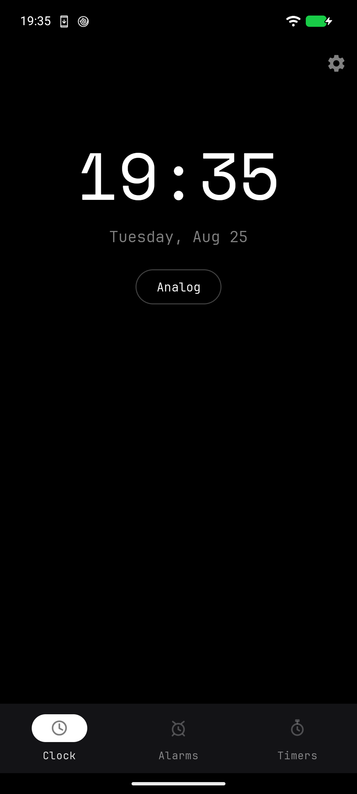

# XX Clock

> It wakes you up and then shuts up.

A cleanroom, offline-first clock / alarm / timer app for Android, built to be
sideloaded onto **GrapheneOS**. No Google Play Services, no INTERNET
permission, no analytics — verifiable in the manifest, and in the built APK:

```
package: com.piercingxx.xxclock        minSdk 29 (Android 10)
version 1.0                            target/compileSdk 35
```



## Features

- **Clock tab** — large digital clock (`TextClock`), date, next-alarm card
  ("Work · Tue 07:00 · in 9 h 12 m"), analog/digital style toggle.
- **Home-screen widget** — self-updating digital clock + date + next-alarm line.
  Zero battery cost (RemoteViews `TextClock`, no ticking service).
- **Alarms** — weekly recurrence (Mon-first day chips), labels, vibrate,
  one-shot or repeating; snooze (10 min) and dismiss from the full-screen
  alert or the notification; gradual volume ramp; auto-silence after 10 min;
  "Alarm set for …" confirmation snackbar.
- **Per-alarm ringtone** — each alarm carries its own tone, chosen through the
  system alarm picker (built-in tones plus anything in `/sdcard/Ringtones`).
  At ring time the player walks chosen tone → system alarm default →
  notification default, dropping blanks and duplicates. A tone whose file was
  deleted or whose provider vanished falls through to the next candidate, so an
  alarm cannot ring silent because of a stale pick. The ordering rule lives in
  `audio/RingCandidates.kt` with no `android.*` imports, so it is tested on the
  JVM rather than hoped at.
- **Timers** — presets (1/3/5/10 min) + custom duration; multiple simultaneous
  timers; pause/resume/+1 min/reset; wall-clock deadlines survive process death;
  "+1 min" and "Stop" on the ringing notification.
- **Reliability design**
  - Alarms scheduled via `AlarmManager.setAlarmClock()` — exact, fires through
    Doze, feeds the system next-alarm indicator, no exact-alarm permission gate.
  - Timers via `setExactAndAllowWhileIdle` with `setWindow` fallback.
  - Full re-registration on `BOOT_COMPLETED` / package update; reconciliation on
    time-set / timezone-change / app start.
  - Ringing runs in a foreground service (`specialUse`) holding a partial
    wakelock; any failure degrades to a "missed" notification instead of a crash.
- **DND survival (belt and braces)**
  1. Alarm audio plays on `USAGE_ALARM` / `STREAM_ALARM`, which Do Not Disturb
     allows through by default (same as Pixel Clock).
  2. Notification channels are created with `setBypassDnd(true)` — effective once
     you grant the app **Do Not Disturb access** (Setup screen walks you through it).

## Theming

Nine apps in the family share one theme contract. XX-Launcher broadcasts
`xx.launcher.THEME_CHANGED` carrying a theme name and a background ARGB; every
app has an exported receiver that persists the choice and repaints. Eight
presets: AMOLED Night, Graphite, Forest Night, Ocean Drift, Burgundy, Paper,
Mist, Custom.

XX Clock also picks its own. **Setup → Theme** lists all eight; a manual pick
resolves to exactly the `SyncedTheme` a matching broadcast would produce and
goes down the same persist-and-repaint path, so nothing downstream can tell the
two apart. Last writer wins — a later broadcast overrides an earlier tap, and a
later tap overrides an earlier broadcast. Custom reuses the launcher's last
broadcast custom ground, and is inert until there has been one.

**The ground is a choice, never an observation.** The launcher and the picker
are the only two inputs. XX Clock does not read the system dark-mode setting,
an auto-dark sunrise/sunset schedule, or the time it is displaying. Set Paper
at noon and it is still Paper at midnight with system dark mode on. Never
chosen anything, or just wiped app data? AMOLED Night — the family default the
sibling apps start at, and what the screenshot above shows. Paper renders the
same at midnight with system dark mode on as it does at noon; the ground moves
only when you move it.

Mechanically: a dark theme pins `MODE_NIGHT_YES` and then overpaints the exact
preset ground; Paper and Mist pin `MODE_NIGHT_NO`, whose resources already
*are* Paper and Mist. The `values-night/` set stays, but it is an internal
switch thrown from the stored theme's `isDark` — the app is never left on
`MODE_NIGHT_FOLLOW_SYSTEM`. The full-screen alarm alert is a deliberate
constant: its own non-DayNight theme, ink ground, Signal-white digits. 3 a.m.
is not the moment for a Paper screen.

Painting the right ground turned out not to be enough. Force dark — the
renderer inverting an already-drawn light window when the *system* is in night
mode — got Paper anyway: correct color stored, correct color painted, then
lightness-inverted to a dark warm brown with white text. The documented theme
opt-out, `android:forceDarkAllowed=false`, did not stop it on a Pixel 6 running
GrapheneOS, so every window this app opens also clears
`View.setForceDarkAllowed` on its decor view — activities, the alarm alert, and
dialogs, each of which owns a separate window and has to ask separately. The
theme attribute stays as stated intent; the decor-view flag is the enforcement.
It works one layer lower, on the RenderNode, and consults no theme,
configuration or context on the way.

This is a behavior change. XX Clock used to fall back to the system dark-mode
setting when nothing had been chosen — Paper by day, ink by night. It no longer
does, at any time, for any reason.

Both activities set `fitsSystemWindows`, because targetSdk 35 draws edge to
edge and otherwise the Setup gear renders underneath the status bar. Fixed and
verified on a Pixel 6.

## Nope-Mode integration

[Nope-Mode](https://github.com/PiercingXX/Nope-Mode) suspends packages via device
owner (`setPackagesSuspended`) and exposes **no pause/override API** — a suspended
app cannot ring, notify, or launch. Therefore:

> **Keep XX Clock OUT of Nope-Mode's blocked-apps list.**

The Setup screen shows this warning permanently. Structurally, XX Clock is as
alarm-proof as Android allows: `setAlarmClock()` scheduling, full-screen-intent
alert over the lock screen, bypass-DND channels, and optional battery-optimization
exemption. Nope-Mode's own zen rule deliberately leaves the alarm category alone,
so the two compose cleanly when the clock isn't suspended.

## Sideload onto GrapheneOS

1. Build the APK (see below) and copy it to the phone (USB, Syncthing, etc.).
2. Open it from **Files** (or Vanadium). When prompted, allow
   **Install unknown apps** for that source — one-time per-app grant.
3. Install. First launch asks for notification permission — allow it. Then open
   **XX Clock → Setup** (gear icon, top right) and walk the checklist:
   - Notifications — allow
   - Exact alarms — should already be granted (`USE_EXACT_ALARM`)
   - **Do Not Disturb access** — grant so alarms break through DND reliably
   - Full-screen alarm display — enabled by default for sideloaded alarm apps
   - Battery optimization — recommended to exempt
4. Add the widget: long-press home screen → Widgets → XX Clock.
5. In Nope-Mode: do **not** add `com.piercingxx.xxclock` to blocked apps.

## Build from source

Toolchain: JDK 21 running Gradle 8.11.1, JVM target 17, Android SDK platform 35
(AGP 8.9.1, Kotlin 2.1.20).

```bash
export ANDROID_HOME=$HOME/Android/Sdk
./gradlew assembleRelease       # -> app/build/outputs/apk/release/
./gradlew testDebugUnitTest     # 95 JVM unit tests
./gradlew lint                  # 0 errors
```

The 95 cover weekly-recurrence math (`time/NextOccurrence`), timer deadline
math, weekday-mask packing, the ringtone fallback order, the theme preset
table, the broadcast receiver's parsing, and the theme-authority rule — an
unset theme resolves to AMOLED Night, the night mode resolves from the chosen
theme's `isDark` and nothing else, and the force-dark revocation reaches every
window including the alarm screen. Everything that could be written as a pure
function was, so it could be tested without a device.

Signing: no keystore is committed to this repo. Release builds are signed only
if you supply credentials via a gitignored `keystore.properties` at the repo
root (`storeFile` / `storePassword` / `keyAlias` / `keyPassword`) or via the
environment variables `XXCLOCK_STORE_FILE` / `XXCLOCK_STORE_PASSWORD` /
`XXCLOCK_KEY_ALIAS` / `XXCLOCK_KEY_PASSWORD`. Without either, the release APK
is built unsigned — sign it yourself with `apksigner`, or sideload the debug
build for testing.

## Architecture notes

Single module, classic Views, Kotlin. Persistence is SharedPreferences +
org.json (no Room). See `CONTRACT.md` for the component map:

- `time/NextOccurrence.kt` — pure weekly-recurrence math (DST-safe)
- `data/ClockStore.kt` — definitions + per-alarm runtime state (scheduled/snoozed/ringing)
- `scheduler/ExactScheduler.kt` — all AlarmManager access
- `alarm/AlarmCoordinator.kt` — fire/snooze/dismiss/reconcile state machine
- `service/RingService.kt` + `audio/KlaxonPlayer.kt` — CATEGORY_ALARM
  full-screen-intent notification, alarm-stream audio, vibration
- `audio/RingCandidates.kt` — the pure "never ring silent" fallback ordering
- `theme/` — preset table, store, broadcast receiver, and the applier that
  pins night mode and the ground color from the chosen theme (never the system)
- `widget/DigitalWidgetProvider.kt` — RemoteViews widget
- `ui/SetupActivity.kt` — permission checklist, theme picker, Nope-Mode advisory

## Branding

Follows the [PiercingXX brand system](https://github.com/PiercingXX/piercingxx-branding):
AMOLED Ink background, Signal-white accent (the clock face *is* the accent),
white/black opacity ramps for hierarchy, Space Mono display + JetBrains Mono
body (bundled in `res/font/`), and the underlined-XX logomark as the launcher
icon. Tokens live in `res/values/colors_brand.xml` — consumed, not retyped.

## Cleanroom statement

Original implementation. Behavior was specified from public documentation of
Google Clock (Pixel), AOSP DeskClock, Fossify Clock and Alarmio; no source code
or assets were copied from any of them. Algorithms (weekday-mask recurrence,
wall-clock timer deadlines, boot reconciliation) follow publicly documented
platform patterns.

## Known limitations (v1)

- One-shot alarms whose fire window passes while powered off are silently
  rescheduled to tomorrow (recurring alarms always keep their next occurrence).
- English-only day summaries.
